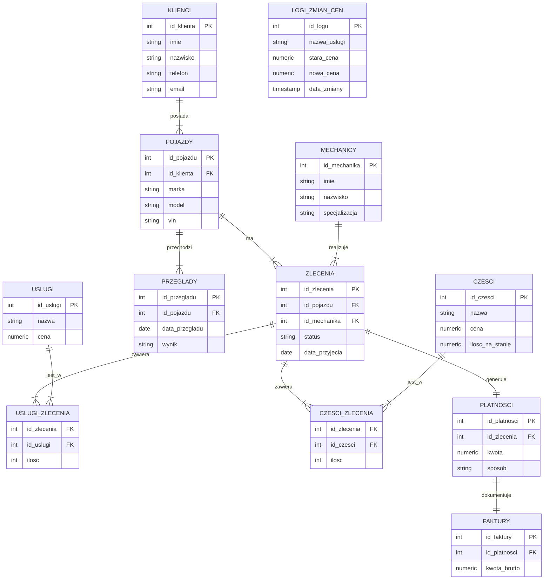

# 🚗 System Zarządzania Warsztatem Samochodowym

Projekt relacyjnej bazy danych wspierający obsługę warsztatu samochodowego. Projekt łączy zaawansowaną logikę w bazie danych PostgreSQL (Triggery, Procedury) z aplikacją webową (React + Node.js).

## 📋 O projekcie

Celem projektu jest usprawnienie pracy warsztatu poprzez cyfryzację kluczowych procesów. Baza danych pozwala na:
* Zarządzanie bazą klientów i historią ich pojazdów.
* Monitorowanie zleceń naprawy i statusów pracy mechaników.
* **Automatyczne zarządzanie stanem magazynowym** (Triggery).
* **Symulację ról użytkowników** (Kierownik, Recepcja, Mechanik) w aplikacji.
* Generowanie raportów finansowych i rankingów efektywności.

## 📊 Schemat Bazy Danych (ERD)

## 🛠 Technologie
* **Baza danych:** PostgreSQL 16/17
* **Backend:** Node.js + Express
* **Frontend:** React + Vite
* **Komunikacja:** Axios + pg (node-postgres)
* **Narzędzia:** Visual Studio Code, Git

## 🚀 Instalacja i Uruchomienie

Pełna instrukcja instalacji środowiska znajduje się w pliku: 👉 **[INSTALL.md](./INSTALL.md)**

## 💡 Kluczowe funkcjonalności (SQL)

### 1. Automatyzacja Magazynu (Trigger)
System posiada trigger `aktualizuj_stan_magazynu`, który automatycznie zdejmuje części ze stanu magazynowego w momencie przypisania ich do zlecenia. Zapobiega to sprzedaży części, których fizycznie nie ma.

### 2. Widoki Analityczne
* **`widok_aktywne_zlecenia`**: Łączy dane z 4 tabel, aby pokazać recepcji czytelny status naprawy.
* **`widok_ranking_mechanikow`**: Raport pokazujący, który pracownik generuje największy przychód dla firmy.

### 3. Procedury Składowane
Zaimplementowano procedury takie jak `zakoncz_zlecenie`, która automatycznie zamyka zlecenie i ustawia datę finalizacji.

---
*Projekt wykonany w ramach przedmiotu Bazy Danych. Autorzy: Tharon23, ultimus12*
