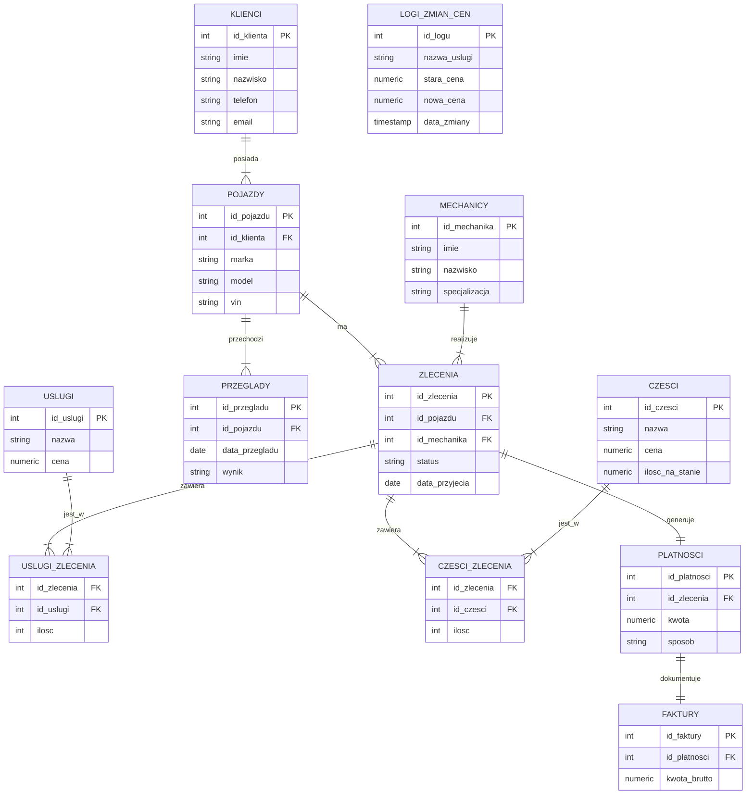

# 🚗 System Zarządzania Warsztatem Samochodowym

Projekt relacyjnej bazy danych stworzony w PostgreSQL, wspierający obsługę warsztatu samochodowego. System obsługuje procesy od przyjęcia klienta, przez naprawę, zarządzanie magazynem części, aż po fakturowanie.

## 📋 O projekcie

Celem projektu jest usprawnienie pracy warsztatu poprzez cyfryzację kluczowych procesów. Baza danych pozwala na:
* Zarządzanie bazą klientów i historią ich pojazdów.
* Monitorowanie zleceń naprawy i statusów pracy mechaników.
* **Automatyczne zarządzanie stanem magazynowym** (Triggery).
* Generowanie raportów finansowych i rankingów efektywności.

## 📊 Schemat Bazy Danych (ERD)

## 🛠 Technologie
* **Baza danych:** PostgreSQL 16/17
* **Język:** SQL (PL/pgSQL)
* **Narzędzia:** Visual Studio Code, Git

## 🚀 Jak uruchomić projekt?

Kod SQL został podzielony na moduły dla łatwiejszego wdrożenia. Uruchom pliki w następującej kolejności:

1.  `01_schema.sql` - Tworzy strukturę tabel (Klienci, Pojazdy, Zlecenia, itd.).
2.  `02_constraints.sql` - Dodaje klucze obce i relacje między tabelami.
3.  `03_views.sql` - Tworzy widoki analityczne (np. ranking mechaników).
4.  `04_functions_triggers.sql` - Wgrywa logikę biznesową (automatyzacja magazynu).
5.  `05_roles.sql` - Konfiguruje uprawnienia użytkowników.
6.  `06_seed_data.sql` - Wypełnia bazę przykładowymi danymi testowymi.

## 💡 Kluczowe funkcjonalności (SQL)

### 1. Automatyzacja Magazynu (Trigger)
System posiada trigger `aktualizuj_stan_magazynu`, który automatycznie zdejmuje części ze stanu magazynowego w momencie przypisania ich do zlecenia. Zapobiega to sprzedaży części, których fizycznie nie ma.

### 2. Widoki Analityczne
* **`widok_aktywne_zlecenia`**: Łączy dane z 4 tabel, aby pokazać recepcji czytelny status naprawy.
* **`widok_ranking_mechanikow`**: Raport pokazujący, który pracownik generuje największy przychód dla firmy.

### 3. Procedury Składowane
Zaimplementowano procedury takie jak `zakoncz_zlecenie`, która automatycznie zamyka zlecenie i ustawia datę finalizacji.

---
*Projekt wykonany w ramach przedmiotu Bazy Danych.*
